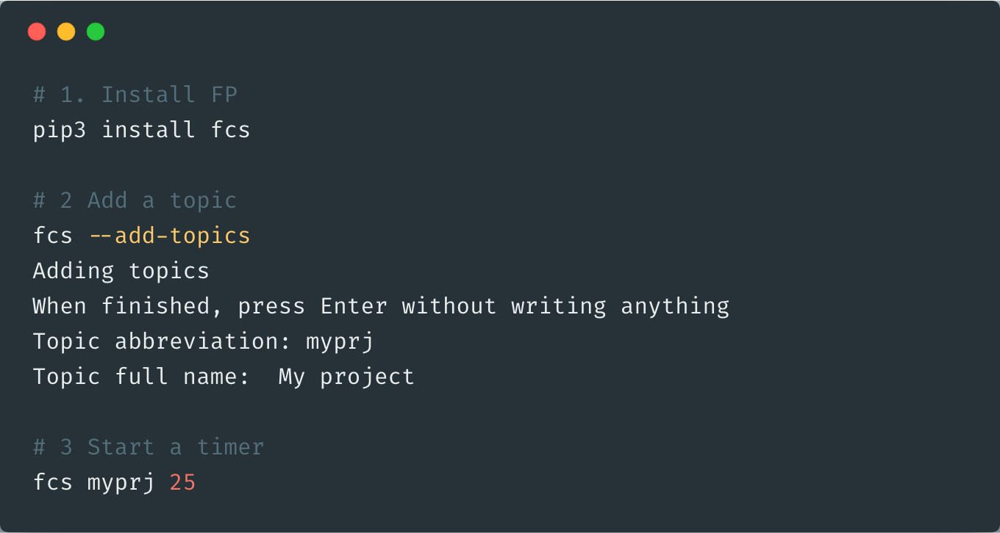

 

 

Focus Phase (FP) is a **simple** yet **powerful** timer and **time tracker**. It is a command-line application written in Python and can be installed with one command. 

FP has two timers: one for when you know for how long you are going to work (like a Pomodoro timer), and the other for when you don't know in advance for how long you are going to work. FP keeps a log of all your work in a csv file on your device. FP allows you to see statistics and graphs about your previous work also.

To learn how to install and use Focus Phase and how it works, visit the Github page:

# Features

#### 💧 Easy to use

Focus Phase is intended to be simple: two commands for two kinds of timers, and one command for configurations

#### ⏱ Two timers

Focus Phase has two timers. One for when you know in advance for how long you want to work, and the other for when you don't

#### 🗃 Review your past work

You can view your history in a beautiful table or get insightful summaries using Focus Phase calculation function

#### 📊 Visualize your history

You can generate beautiful visualizations to see your activity over the days

#### 🗄 Your data is your own

All logs are saved in formatted csv files on your device so you can use it however you want

#### 💡 And many more...

Focus Phase has many more features that let you control how the program work

 

### Don't take our word for it! Try it out yourself!

 

---

For any suggestion or enquiry, contact me by [my email](mailto:ammar5656@gmail.com). 

Visit [my website](http://ammar-alyousfi.com/) for more projects. Support me (<a href="https://paypal.me/ammar1y" target="_blank"><strong>PayPal</strong></a>).

[LinkedIn](https://linkedin.com/in/ammar-alyousfi/) \| [Twitter](https://twitter.com/ammar_cel) \| [Github](https://github.com/ammar1y) 

© Ammar Alyousfi 2018

